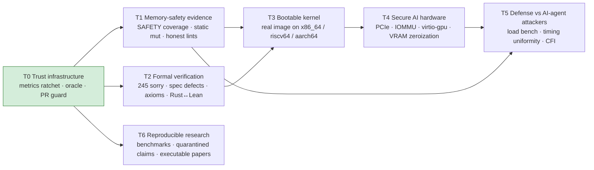

# RunuX Roadmap — Open for Contribution

RunuX is too large to finish alone. This roadmap splits it into **tracks** that
people and AI agents can take on independently. Every milestone has an exit
criterion measured by a script in this repository, not by assertion. Detailed
plans are linked for each track. Priority follows
[`docs/roadmap/BUSINESS_CASE_PRIORITIZED_PLAN.md`](docs/roadmap/BUSINESS_CASE_PRIORITIZED_PLAN.md):
low effort and high impact first.

## Tracks

| Track | Why it matters | Start here | Plan |
|---|---|---|---|
| **T0 Trust infrastructure** ✅ mostly built | Makes every other contribution checkable, including by AI agents | CI wiring for `pr_guard` and the agent workflows | [`RESEARCH_DIRECTIONS.md`](docs/roadmap/RESEARCH_DIRECTIONS.md) §A |
| **T1 Memory-safety evidence** | Evidence of the kind regulators and memory-safety roadmaps ask for | [`area:unsafe`](https://github.com/xaviercallens/rust-linux-mini-kernel/issues?q=is%3Aopen+label%3Aarea%3Aunsafe) | [`BUSINESS_CASE_PRIORITIZED_PLAN.md`](docs/roadmap/BUSINESS_CASE_PRIORITIZED_PLAN.md) Wave 1 |
| **T2 Formal verification** | Certified software that states only what has been proved | [`area:lean`](https://github.com/xaviercallens/rust-linux-mini-kernel/issues?q=is%3Aopen+label%3Aarea%3Alean) | [`RUNUX_V12_VERIFIED_CORE_PLAN.md`](docs/roadmap/RUNUX_V12_VERIFIED_CORE_PLAN.md) WS1, WS4 |
| **T3 Bootable kernel** | All three arches now boot real code: RISC-V via OpenSBI ([`scripts/riscv_boot_test.sh`](scripts/riscv_boot_test.sh)), x86_64 via GRUB Multiboot2 into genuine 64-bit long mode ([`scripts/x86_64_boot_test.sh`](scripts/x86_64_boot_test.sh)), AArch64 via a from-scratch `arch/aarch64` with real EL3/EL2→EL1 descent and PSCI shutdown ([`scripts/aarch64_boot_test.sh`](scripts/aarch64_boot_test.sh)) — x86_64 and AArch64 both call real crate logic (`kernel_types::SafePageFrame`) rather than only print banners. Subsystem init (PLIC/Sv39 on riscv64; IDT/APIC/drivers on x86_64; GIC/pgtables on aarch64) remains stub work | [`area:boot`](https://github.com/xaviercallens/rust-linux-mini-kernel/issues?q=is%3Aopen+label%3Aarea%3Aboot) | [`RUNUX_V12_VERIFIED_CORE_PLAN.md`](docs/roadmap/RUNUX_V12_VERIFIED_CORE_PLAN.md) WS5 |
| **T4 Secure AI hardware** | AI workloads on standard servers with DMA isolation and no leaks between tenants. Real progress (not the M4 exit criterion below, which is unmet): real PCIe config-space I/O + BAR probing verified against a real Google Cloud TPU-accelerator VM (n=30, independent sysfs oracle, `vfio-pci`/AMD-Vi IOMMU evidence) and real ML-workload syscall traces replayed through the unmodified `ebpf_firewall`/`ai_detector` — [`TPU_ACCELERATOR_IMPROVEMENT_PLAN.md`](docs/roadmap/TPU_ACCELERATOR_IMPROVEMENT_PLAN.md) (M0-M5 tracked there); real NVIDIA GPU (T4/L4/RTX) access was blocked by an exhausted project-wide `GPUS_ALL_REGIONS` quota — [`GCP_AI_KERNEL_MILESTONE_PLAN.md`](docs/roadmap/GCP_AI_KERNEL_MILESTONE_PLAN.md) | [`area:hardware`](https://github.com/xaviercallens/rust-linux-mini-kernel/issues?q=is%3Aopen+label%3Aarea%3Ahardware) | [`STANDARD_HARDWARE_AI_GPU_PLAN.md`](docs/roadmap/STANDARD_HARDWARE_AI_GPU_PLAN.md), [`TPU_ACCELERATOR_IMPROVEMENT_PLAN.md`](docs/roadmap/TPU_ACCELERATOR_IMPROVEMENT_PLAN.md) |
| **T5 Defense vs AI-agent attackers** | Attackers are now adaptive, machine-speed, and query defenses as black boxes | [`area:security`](https://github.com/xaviercallens/rust-linux-mini-kernel/issues?q=is%3Aopen+label%3Aarea%3Asecurity) | [`AI_AGENT_DEFENSE_PLAN.md`](docs/roadmap/AI_AGENT_DEFENSE_PLAN.md) |
| **T6 Reproducible research** | Every number is backed by a script, so no hallucinated results | [`area:research`](https://github.com/xaviercallens/rust-linux-mini-kernel/issues?q=is%3Aopen+label%3Aarea%3Aresearch) | [`PAPER_VERIFICATION_TODO.md`](docs/roadmap/PAPER_VERIFICATION_TODO.md) |

## Milestones

| Milestone | Exit criterion (measured) | Tracks |
|---|---|---|
| **M1: Honest core** | Core set (13 crates): every `unsafe` block justified or listed as possible UB; 0 `static mut`; no blanket `#[allow(clippy::all)]`; `ai_detector` aliasing bug fixed. **4/8 crates done** ([#59](../../pull/59), [#61](../../pull/61)-[#63](../../pull/63)); `ai_bridge`/`page_alloc`/`slab` remain, `vmalloc` blocked on [#60](../../issues/60) | T1 |
| **M2: Spec triage** | All 245 open `sorry` classified; every "false as stated" candidate either disproved in `MVK/Audit/` or reclassified; arithmetic-class obligations closed | T2 |
| **M3: It boots** | **All three legs boot**: `examples/riscv_qemu_harness` via OpenSBI ([`scripts/riscv_boot_test.sh`](scripts/riscv_boot_test.sh), independently re-verified on GCP, 30/30, [`telemetry`](docs/roadmap/RISCV_BOOT_TELEMETRY.md)); `examples/x86_64_qemu_harness` via GRUB Multiboot2 into real long mode ([`scripts/x86_64_boot_test.sh`](scripts/x86_64_boot_test.sh), independently re-verified on GCP, 30/30, [`telemetry`](docs/roadmap/X86_64_BOOT_TELEMETRY.md)); `examples/aarch64_qemu_harness` via direct `-kernel` load on `qemu-system-aarch64 virt` ([`scripts/aarch64_boot_test.sh`](scripts/aarch64_boot_test.sh), independently re-verified on GCP, 30/30, [`telemetry`](docs/roadmap/AARCH64_BOOT_TELEMETRY.md)). None wired into CI yet. Remaining: PLIC/Sv39 made real (not print-only) on riscv64; IDT/APIC/drivers on x86_64; real GIC/pgtables on aarch64; a syscall smoke test on any | T3 |
| **M4: Safe GPU path** | `virtio-gpu` command → fence completes in QEMU; IOMMU isolation and VRAM zeroization proven in Lean; `fuzz_gpu_commands` clean | T4 |
| **M5: Agent-grade defense** | Defense pipeline measured at 10³–10⁵ req/s; rejection paths statistically indistinguishable by timing | T5 |
| **Ongoing** | `scripts/metrics.py ratchet` never regresses; every quarantined paper claim is restored with a script or retracted | T0, T6 |

## Current numbers

Run `python3 scripts/metrics.py measure`. As of v11.3.0:

- 245 open `sorry` and 138 axioms across 434 theorems in 37 Lean files
- Core set started at 101 undocumented `unsafe` blocks and 10 `static mut` (13 crates). Wave 1 has documented 8 of those 101 (`syscall_table` 1, `kernel_types` 2, `immutable_logs` 5) and removed 4 of the 10 `static mut` (`syscall_table`, `netfilter`, `kernel_types`×2). `netfilter`'s 1 block was correctly flagged as not-yet-justifiable rather than documented ([#64](../../issues/64)); 92 blocks remain in `ai_bridge`/`page_alloc`/`slab`/`vmalloc` — see README → Measured Status for the live count
- 141 of 316 crates are placeholders

## Reproducible boot images

The RISC-V, x86_64 (GRUB Multiboot2 ISO), and AArch64 binaries verified above
are mirrored publicly, no account needed, with checksums and a QEMU
reproduce guide: [`gs://socrateai-datalake-gen-lang-client-0625573011/runux-boot-images/`](https://storage.googleapis.com/socrateai-datalake-gen-lang-client-0625573011/runux-boot-images/README.md).

## Call to action

If you care about **memory-safe infrastructure**, **software that is certified
rather than merely claimed**, **AI that is efficient because its output is
verifiable**, or **systems that hold up against AI-assisted attacks**, pick a
track. Read [`CONTRIBUTING.md`](CONTRIBUTING.md) (humans) or
[`AGENTS.md`](AGENTS.md) (AI agents), take an issue, and bring the oracle output.
