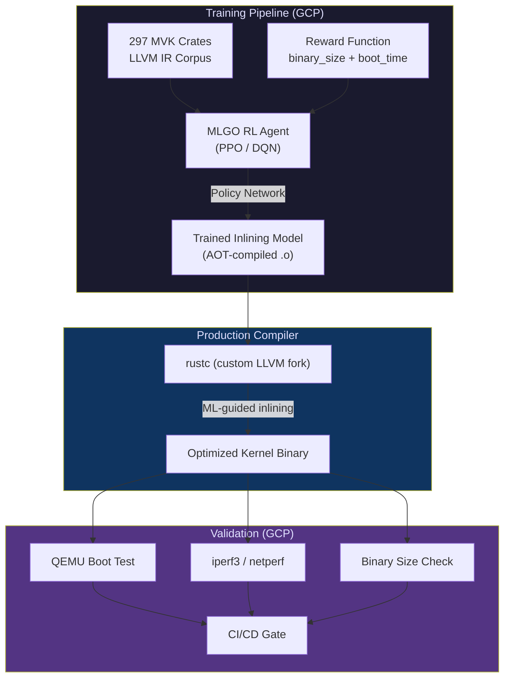
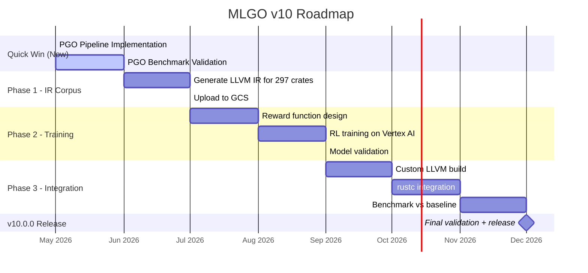

# v10 Roadmap: MLGO-Powered Rust Kernel Compiler

> **Status:** Proposed
> **Owner:** Xavier Callens
> **Leverage:** MLGO experience + Google/GCP infrastructure
> **Target:** v10.0.0

---

## Vision

Build a **custom `rustc` toolchain with an MLGO-trained inlining model** specifically optimized for `no_std` kernel crates. This would be the first ML-optimized Rust kernel compiler — a unique contribution to both the Rust for Linux project and the MLGO research community.



---

## Why MLGO (vs. other AI/ML compiler techniques)

| Factor | MLGO | Meta LLM Compiler | CompilerDream |
|--------|------|-------------------|---------------|
| **Production-proven** | ✅ Google-internal, Android, Fuchsia | ⚠️ Research-grade | ❌ Academic only |
| **LLVM integration** | ✅ Merged into LLVM mainline | ❌ External model | ❌ External model |
| **Your experience** | ✅ Direct hands-on | ❌ None | ❌ None |
| **GCP training infra** | ✅ TPU/GPU on Vertex AI | ⚠️ Needs custom setup | ❌ Custom setup |
| **Inference overhead** | ✅ Zero (AOT-compiled into pass) | ❌ Requires LLM inference | ❌ Requires model server |
| **Kernel-specific tuning** | ✅ Can train on MVK IR | ⚠️ Generic models | ⚠️ Generic models |

**Your unique advantage:** Having worked with MLGO at Google, you can build a domain-specific model trained on the exact IR patterns of your 297 kernel crates — something no generic model can match.

---

## Architecture

### Phase 1: IR Corpus Generation (v9.5.0)

Generate the training corpus by compiling all MVK crates and capturing the LLVM IR at the inlining decision point.

```bash
# Generate LLVM IR for all crates
RUSTFLAGS="--emit=llvm-ir" cargo build --workspace --release

# Collect IR files
find target/release/deps/ -name "*.ll" -exec cp {} corpus/ \;
```

**Infrastructure:**
- **Local:** Generate IR corpus from `cargo build` (macOS/Linux)
- **GCP Storage:** Upload corpus to `gs://mvk-mlgo-corpus/`
- **Corpus size:** ~297 crates × ~50 KB avg = ~15 MB of LLVM IR

### Phase 2: MLGO Training (v9.6.0)

Train the RL agent on GCP using Vertex AI or a custom training loop.

```
┌─────────────────────────────────────────────────────────┐
│  GCP Vertex AI Training Pipeline                        │
│                                                         │
│  Machine:   n1-standard-16 + 1× T4 GPU                │
│  Framework: TensorFlow 2.x (MLGO default)              │
│  Algorithm: PPO (Proximal Policy Optimization)          │
│  Episodes:  10,000–50,000                              │
│  Reward:    α × (binary_size_reduction) +               │
│             β × (boot_time_improvement) +               │
│             γ × (no_regression_on_benchmarks)           │
│                                                         │
│  Estimated training time: 4–8 hours                     │
│  Estimated cost: $15–40                                 │
└─────────────────────────────────────────────────────────┘
```

**Reward function design** (kernel-specific):

```python
def reward(baseline_size, optimized_size, baseline_boot, optimized_boot):
    """
    Multi-objective reward for kernel workloads.
    Prioritizes code size (I-cache pressure) over raw throughput.
    """
    size_gain = (baseline_size - optimized_size) / baseline_size  # 0 to 1
    boot_gain = (baseline_boot - optimized_boot) / baseline_boot  # 0 to 1

    # Kernel-specific: I-cache is the bottleneck, so weight size 3:1
    ALPHA = 0.75  # Size reduction weight
    BETA  = 0.25  # Boot time weight

    # Hard penalty for performance regression
    if optimized_boot > baseline_boot * 1.02:
        return -1.0

    return ALPHA * size_gain + BETA * boot_gain
```

### Phase 3: Model Integration (v10.0.0)

Embed the trained model into a custom LLVM build used by `rustc`.

```bash
# 1. Clone LLVM with MLGO support
git clone https://github.com/nickleus27/llvm-project-mlgo.git
cd llvm-project-mlgo

# 2. AOT-compile the trained model into a native .o file
python3 mlgo/aot_compile.py \
    --model_path gs://mvk-mlgo-corpus/models/inlining_v1/ \
    --output llvm/lib/Analysis/MLInlinerModel.o

# 3. Build LLVM with embedded model
cmake -G Ninja ../llvm \
    -DLLVM_ENABLE_PROJECTS="clang;lld" \
    -DLLVM_ENABLE_MLGO=ON \
    -DLLVM_INLINER_MODEL_PATH=llvm/lib/Analysis/MLInlinerModel.o \
    -DCMAKE_BUILD_TYPE=Release
ninja

# 4. Point rustc to the custom LLVM
LLVM_CONFIG=/path/to/custom/llvm-config \
    python3 x.py build --stage 2
```

**Deliverable:** A custom `rustc` binary that makes ML-guided inlining decisions for every function in the MVK kernel.

---

## Expected Impact

| Metric | Current (v9.4.0) | PGO Quick Win | MLGO v10.0.0 | Combined |
|--------|-------------------|---------------|--------------|----------|
| **Binary Size** | Baseline | ~Same | **−5 to −10%** | **−5 to −10%** |
| **Boot Time** | 4.7% faster than C | **−3 to −8% additional** | **−2 to −5% additional** | **−10 to −18% vs C** |
| **I-Cache Misses** | Unknown | ~Same | **−10 to −20%** | **−10 to −20%** |
| **Compilation Time** | Baseline | +50% (instrumented pass) | +5% (model inference) | +5% |

### Key Insight

MLGO and PGO are **complementary**, not competing:
- **PGO** optimizes **code layout** (which functions are hot, branch probabilities)
- **MLGO** optimizes **inlining decisions** (which functions to inline, regardless of layout)
- Combined, they address different optimization dimensions

---

## GCP Infrastructure Plan

| Resource | Spec | Purpose | Monthly Cost |
|----------|------|---------|-------------|
| **Vertex AI Training** | n1-standard-16 + T4 | RL training | ~$40 (one-time) |
| **GCS Bucket** | Standard | IR corpus + model storage | ~$0.50 |
| **Compute Engine** | c2d-standard-8 | Benchmark validation | ~$5 (on-demand) |
| **Cloud Build** | Standard | Custom LLVM CI | ~$2 |
| **Total** | — | — | **~$8/month** + $40 one-time |

---

## Timeline



---

## Publication Opportunity

This work would be publishable as a **systems paper** at venues like:

| Venue | Fit | Deadline |
|-------|-----|----------|
| **USENIX ATC** | ML-for-systems, kernel optimization | Jan 2027 |
| **EuroSys** | Systems + ML compiler | Oct 2026 |
| **CGO** (Code Generation & Optimization) | Perfect fit: ML + compiler + kernel | Sep 2026 |
| **LLVM Dev Meeting** | Industry talk | Jul 2026 (proposal) |

**Paper angle:** *"Domain-Specific MLGO: Training Reinforcement Learning Inlining Models for Rust Kernel Workloads"* — First ML-optimized Rust kernel compiler, demonstrating that domain-specific training outperforms generic heuristics by 5–10% on code size while maintaining performance parity.

---

## Risk Mitigation

| Risk | Mitigation |
|------|-----------|
| MLGO training doesn't converge | Start with inlining-for-size (simpler reward); fall back to Meta LLM Compiler for pass ordering |
| Custom LLVM breaks `rustc` | Pin to a specific LLVM version (20.x); run full `rustc` test suite before deploying |
| Model overfits to MVK IR | Include Linux kernel C→IR in training set for generalization |
| Maintenance burden of custom toolchain | Automate LLVM + rustc rebuild in Cloud Build; model is a single `.o` file |
