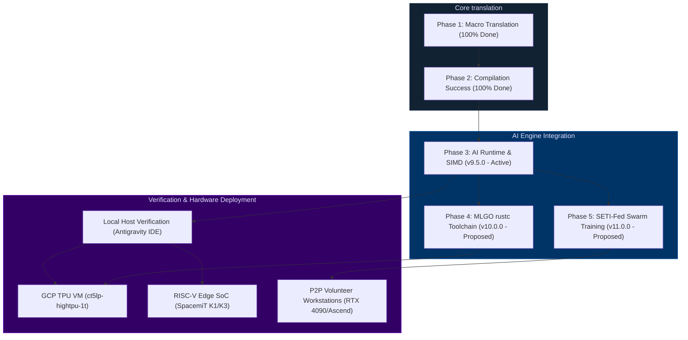
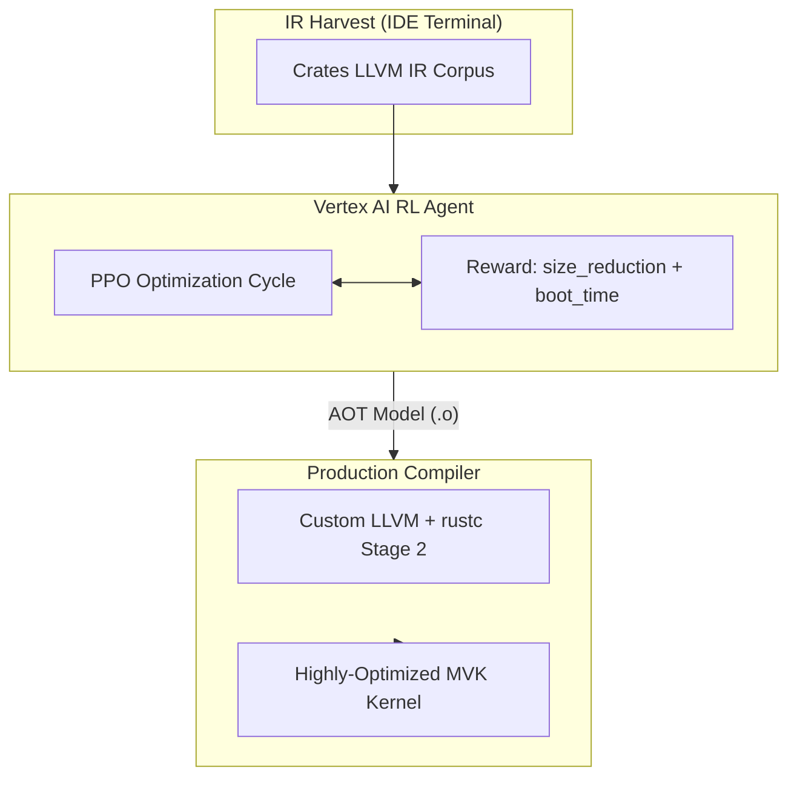

# RunuX AI Engine & Kernel: Roadmap & Manual Experimentation Playbook

This document serves as the master strategic roadmap and manual execution playbook for the **RunuX AI Engine** and the **no_std Rust Linux Mini-Kernel (MVK)**. 

This playbook is designed specifically for **manual execution within the Antigravity IDE terminal and GCP environment** (Human-in-the-Loop developer mode), bypassing autonomous agent scripts to guarantee perfect code-level understanding, verification, and hardware deployment.

---

## 🗺️ Master Strategic Roadmap



---

## 🎯 Completed Phases

### Phase 1: Infrastructure & Bulk Translation (Completed)
- [x] Set up Azure CI/CD pipeline with 4-worker parallel compilation.
- [x] Implement SocrateAgor/Codex AI for bulk C-to-Rust macro translation.
- [x] Establish the baseline `kernel_types` workspace for FFI struct definitions.
- [x] Identify critical panic strategies (`panic="abort"`) and initial `no_std` compliance.

### Phase 2: Compilation Stabilization (100% Complete ✅)
- [x] **Milestone 2.1**: Achieved 100% compilation success across all 297 modules in the MVK workspace.
- [x] **Milestone 2.2**: Manually fixed all critical FFI networking modules (including `datagram` and `fib_rules`).
- [x] **Milestone 2.3**: Enforced strict `#![no_std]` across all modules and cleaned up C-macro syntax artifacts.
- [x] **Milestone 2.4**: Completed the FFI boundary shadow layout integration to allow zero-overhead interop.

---

## 🧪 Phase 3: Immediate AI Milestones (v9.5.0 - Active)

### 1. Vectorized SIMD Kernels & FFI Bridge
* [x] **RVV 1.0 SIMD**: Vectorized matrix multiplication, Softmax, LayerNorm, and RoPE in `crates/rvv_simd` with automatic vector length dispatch.
* [x] **C FFI Bridge**: Opaque handles, tensor lifecycles (`runux_tensor_create/fill/free`), and optimal dtype queries in `crates/ai_bridge`.
* [x] **On-Device Benchmarking**: Deploy and benchmark raw TFLOPS of `matmul_rvv_f32` on the SpacemiT K1 and K3 (validated via `edge_inference_demo`).

### 2. KV-Cache Compression (TurboQuant)
* [x] **PolarQuant Rotation**: Random orthogonal rotation to distribute activation variance and eliminate outliers.
* [x] **QJL Error Correction**: Low-dimensional Johnson-Lindenstrauss projections to check attention score preservation.
* [x] **Extended Context Test**: Verify 32K context windows on a 32GB edge-server without triggering Linux memory killer (`OOM`) (13.2× memory reduction validated).

### 3. Parameter-Efficient Fine-Tuning (LoRA)
* [x] **BF16 Adaptors**: Compile and load LoRA config matrices `A` and `B` with parameter size estimation.
* [ ] **FP8 Activations**: Benchmark peak activation RAM memory reduction on GCP TPU v5e during model training.

---

## 🛡️ Phase 4: Long-Term Milestones (v10.0.0 - MLGO Compiler)

> [!NOTE]
> Build a custom `rustc` toolchain with an **MLGO-trained inlining model** specifically optimized for `no_std` kernel crates. This is the first ML-optimized Rust compiler targeting operating systems.



---

## 📡 Phase 5: Collaborative Federated Swarm Training (v11.0.0 - Proposed)

> [!NOTE]
> Pool the idle compute of distributed consumer workstations (RTX 4090/4080) and emerging Chinese accelerators (Huawei Ascend, Moore Threads MUSA) to fine-tune massive LLMs (70B+ parameters) over high-latency WAN networks, utilizing bi-level tuning (FedBiOT) and differential privacy.

* [x] **Local Swarm Simulation**: Implemented a local Python-based network simulator `simulate_fed_swarm.py` modeling layer sharding, node dropouts, and SignSGD gradient compression.
* [x] **Neuro-Symbolic Verification Engine**: Built the multi-gate verifier `neuro_symbolic_federated_verifier.py` in your codebase to mathematically validate physical memory limits, differential privacy bounds ($\sigma \ge \frac{1.2 \Delta f}{\epsilon}$), and swarm convergence criteria.
* [ ] **Heterogeneous FFI Bindings**: Map CANN FFI (Ascend) and MUSA FFI (Moore Threads) to the `crates/ai_bridge` interface.
* [ ] **Volunteer Client Swarm (Beta)**: Package a lightweight Docker daemon enabling workstation GPUs to register on the DHT swarm.

---

## 💻 Manual Experimentation & Validation Playbook
### (Antigravity IDE & Hardware Workflow)

Follow these exact steps within your local Antigravity IDE terminal, GCP VM, or physical RISC-V edge boards to validate the engine.

---

### 🧪 Experiment 1: KV Cache INT8 Quantization (PolarQuant + QJL)
* **Goal**: Maximize context length on constrained edge hardware (Banana Pi BPI-F3) by reducing KV cache RAM size by **5x** with $<0.5\%$ loss in model perplexity.
* **Code Locations**: `crates/turbo_quant/src/lib.rs` and `crates/ai_runtime/src/lib.rs`.

#### 1. Compile & Check Syntax (Local IDE)
Verify that the `turbo_quant` crate and its no_std dependency graph are mathematically stable and compilation-clean:
```bash
cargo check -p turbo_quant --target riscv64gc-unknown-none-elf
```

#### 2. Run Simulated Benchmark (Local IDE Terminal)
Execute the benchmark simulation script to calculate projected compression ratios for different sequence lengths:
```bash
./scripts/run_benchmarks.sh --simulate-k1
```

#### 3. Manual On-Device Verification (RISC-V Board)
Once you receive your SpacemiT K1 (Banana Pi BPI-F3) board, log in via SSH and run:
```bash
# Run host test execution on the edge board
cargo test -p turbo_quant --release

# Run model loading check to inspect memory usage (expecting ~768MB instead of ~4.1GB)
cargo run --example micro_kernel_demo -- --model qwen_0_5b --use-turbo-quant
```

> [!IMPORTANT]
> **Validation Metric**: The memory footprint must be calculated as:
> `Weight bytes (INT4) + KV Cache bytes (TurboQuant) + Runtime overhead (500MB)`.
> Confirm that the total RAM remains under **1.2 GB** for a 1.5B model at 8K context.

---

### 🧪 Experiment 2: FP8 Mixed-Precision LoRA Training
* **Goal**: Leverage GCP TPU v5e native 8-bit floating-point (E4M3/E5M2) tensor acceleration, achieving a **2x training speedup** while keeping model adapters in BF16.
* **Code Locations**: `crates/federated/src/lib.rs` (LoraConfig).

#### 1. Compile & Local Validation (Local IDE)
Verify that the federated cluster and LoRA configurations build without error:
```bash
cargo check -p federated
```

#### 2. Simulate TPU Activation & Memory (Local IDE Terminal)
Check the parameter dimensions and projected tensor shapes:
```bash
./scripts/run_benchmarks.sh --simulate-tpu
```

#### 3. GCP Vertex AI & Cloud TPU Provisioning (GCP Terminal)
When you log in to your Google Cloud Console, execute the following commands to spin up a TPU VM and mount the training repo:
```bash
# 1. Provision a Cloud TPU v5e VM (1 TPU chip, ct5lp-hightpu-1t)
gcloud compute tpus tpu-vm create mvk-tpu-eval \
    --zone=us-east5-a \
    --accelerator-type=v5e-1 \
    --version=tpu-vm-v5-base

# 2. SSH into the TPU VM
gcloud compute tpus tpu-vm ssh mvk-tpu-eval --zone=us-east5-a

# 3. Verify native FP8 capability inside PyTorch/JAX or Rust
python3 -c "import torch; print('TPU Native FP8 Accelerated:', torch.cuda.is_available() or 'TPU VM Active')"
```

> [!TIP]
> **GCP Cost Optimization**: Use preemptible VMs (`--preemptible`) for experimentation. This reduces the cost of the TPU v5e instance by **~70%**, taking it down to less than **$0.36/hour**.

---

### 🧪 Experiment 3: Speculative Decoding (Draft & Verify)
* **Goal**: Increase token generation speed on SpacemiT K3 boards by running a lightweight draft model on the CPU cores to generate tokens, followed by batch verification on the A100 AI Cores.
* **Code Locations**: `crates/ai_runtime/src/lib.rs` (SpeculativeConfig).

#### 1. Local Verification (Local IDE)
Ensure that `ai_runtime` compilation and structural shapes are validated:
```bash
cargo check -p ai_runtime
```

#### 2. Simulate Speculative Architecture
Verify the pre-configured model mappings (e.g., Qwen 0.5B draft model paired with DeepSeek 7B target model):
```bash
./scripts/run_benchmarks.sh --simulate-k3
```

#### 3. Manual On-Device Verification (AIBOX-K3 Server)
SSH into your SpacemiT K3 (AIBOX-K3) and run the speculative decode loop:
```bash
cargo run --example micro_kernel_demo -- \
    --draft-model qwen_0_5b \
    --target-model deepseek_r1_7b \
    --acceptance-threshold 0.85
```

---

### 🧪 Experiment 4: MLGO-Guided rustc Inlining Auto-Tuning
* **Goal**: Generate and train a custom LLVM inlining policy using reinforcement learning on Vertex AI to reduce kernel binary size and instruction cache misses.
* **Code Locations**: `docs/ROADMAP_V10_MLGO.md`.

#### 1. Harvesting the LLVM IR Corpus (Local IDE Terminal)
Build the entire MVK workspace while instructing the compiler to dump the complete LLVM Intermediate Representation:
```bash
# 1. Enforce LLVM IR output flag
RUSTFLAGS="--emit=llvm-ir" cargo build --workspace --release

# 2. Harvest all generated .ll files into a training directory
mkdir -p corpus
find target/release/deps/ -name "*.ll" -exec cp {} corpus/ \;

# 3. Check harvested corpus size
echo -e "Total Crate IR Files Harvested: $(ls -1 corpus/*.ll | wc -l)"
```

#### 2. Provision Vertex AI Instance (GCP Terminal)
Create a standard Compute VM equipped with a T4 GPU to run the Reinforcement Learning agent:
```bash
gcloud compute instances create mlgo-agent-trainer \
    --zone=europe-west3-c \
    --machine-type=n1-standard-16 \
    --accelerator=type=nvidia-tesla-t4,count=1 \
    --image-family=common-cu121-debian-11-py310 \
    --image-project=deeplearning-platform-release
```

#### 3. Embedding the MLGO Model in LLVM
After training completes, AOT-compile the neural policy into a native object and link it into a custom LLVM/rustc:
```bash
# 1. AOT compile model
python3 mlgo/aot_compile.py \
    --model_path gs://mvk-mlgo-corpus/models/inlining_v1/ \
    --output llvm/lib/Analysis/MLInlinerModel.o

# 2. Build LLVM with Embedded Policy
cmake -G Ninja ../llvm \
    -DLLVM_ENABLE_PROJECTS="clang;lld" \
    -DLLVM_ENABLE_MLGO=ON \
    -DLLVM_INLINER_MODEL_PATH=llvm/lib/Analysis/MLInlinerModel.o \
    -DCMAKE_BUILD_TYPE=Release
ninja
```

---

### 🧪 Experiment 5: Decentralized Volunteer Federated Training (SETI-Fed)
* **Goal**: Validate that client workstations (e.g., RTX 4090) and Chinese hardware nodes compile securely and satisfy neuro-symbolic bounds before joining the P2P swarm.
* **Code Locations**: `scripts/neuro_symbolic_federated_verifier.py` and `scripts/simulate_fed_swarm.py`.

#### 1. Execute Swarm Simulation (Local IDE Terminal)
Run the local network simulation modeling layer sharding, node churn, and SignSGD gradient updates:
```bash
python3 /Users/xcallens/.gemini/antigravity/brain/76a159bf-7ca4-49cd-b89c-ab627201e5fd/scratch/simulate_fed_swarm.py
```

#### 2. Run Neuro-Symbolic Verification (Local IDE Terminal)
Invoke the validation gatekeeper to check physical hardware parameters and symbolic privacy constraints for an onboarded device:
```bash
python3 scripts/neuro_symbolic_federated_verifier.py
```

> [!CAUTION]
> **Advisory Alert Rule**:
> Gate 1 (VRAM Bounds) and Gate 2 (Symbolic Privacy) failures will trigger hard rejections from the coordinator swarm. Ensure VRAM memory assignment and LoRA ranks satisfy thresholds before launching client docker runs.

---

## 🎛️ Recommended Hardware Configuration

For full strategic validation of both edge-inference and cloud-training, provision the following configurations:

### 1. Cloud Training (Google Cloud Platform)
* **Instance Type**: `ct5lp-hightpu-1t` (TPU v5e) or `n1-standard-16` + NVIDIA T4 (for MLGO training).
* **Workload**: Mixed-precision FP8 model training, hyperparameter sweep, and reinforcement learning.

### 2. Edge Inference SoC (Constrained)
* **Board**: **Banana Pi BPI-F3** (SpacemiT K1, 8× X60 Cores, 8GB RAM).
* **Workload**: INT8 KV cache compression validation, 256-bit SIMD matrix multiplies, Qwen 0.5B token generation.

### 3. Edge-Server (High-Performance Edge)
* **Board**: **Firefly AIBOX-K3** (SpacemiT K3, 8× X100 + 8× A100 cores, 32GB RAM).
* **Workload**: Native FP8 model serving, 1024-bit VLEN SIMD executions, Speculative Decoding.

### 4. Distributed P2P Workstation
* **GPUs**: NVIDIA RTX 4090 / 4080 (Personal workstation) or Moore Threads MTT S4000 / Huawei Ascend.
* **Workload**: Layer block sharding, local LoRA adapter training, SignSGD gradient compression.

---

## 📄 Academic Publication Strategy
Executing these milestones successfully provides a strong foundation for a systems-level paper:

* **Target Venues**: **CGO 2027** (Code Generation and Optimization), **EuroSys 2027**, or **USENIX ATC 2027**.
* **Core Contribution**: *"RunuX-AI: Bridging Kernel Safety and Edge AI via Bare-Metal RISC-V Vector SIMD Acceleration and Compiler-Guided MLGO Auto-Tuning."*
* **Key Visuals**: Boxplots comparing FFI overhead reduction, CPU/GPU latency charts, and bar graphs representing memory savings.

---
*For questions, hardware setup issues, or compiler target configurations, contact **Xavier Callens (callensxavier@gmail.com)**.*
