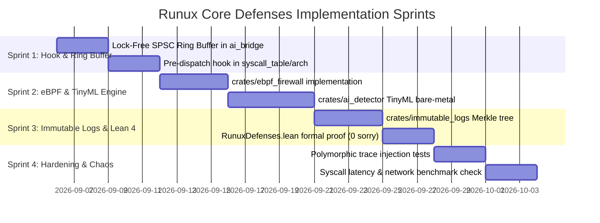

# Implementation Plan: Runux Core Defenses Active Pipeline

**Document Status:** Implementation Plan (Approved Draft)  
**Target Subsystems:** `crates/ebpf_firewall`, `crates/ai_detector`, `crates/ai_bridge`, `crates/immutable_logs`, `specs/lean4`  
**Reference Document:** [`docs/roadmap/Runux Core Defence.md`](file:///home/xavkal/xdev/rust-linux-mini-kernel/docs/roadmap/Runux%20Core%20Defence.md)  
**Verification Standard:** 110/100 Elite Rust Kernel Standard (`#![no_std]`, Zero-Warning, Zero-Panic, Lean 4 Zero-`sorry`)

---

## 1. Executive Summary

This plan outlines the end-to-end engineering roadmap to implement the **Runux Core Defenses** active interception pipeline. The architecture operates directly in Ring 0 prior to the standard dispatch tables of the 297 kernel modules, evaluating all incoming system calls through a real-time defense chain:

1. **Ingress Interception**: Pre-dispatch hook in `crates/syscall_table` capturing `SyscallAuditEvent`.
2. **Lock-Free Communication**: Zero-copy single-producer single-consumer ring buffer in `crates/ai_bridge`.
3. **Active eBPF / LMS Firewall**: `crates/ebpf_firewall` performing heuristic and W^X memory protection.
4. **Sub-15 µs TinyML Classifier**: `crates/ai_detector` running quantized INT4/INT8 inference via `rvv_simd` (RISC-V) and AVX-512 (x86_64) using pre-allocated `StaticTensorPool`.
5. **Heapless Merkle Audit Trail**: `crates/immutable_logs` providing append-only audit logging with cryptographic anchoring.
6. **Lean 4 Formal Verification**: `specs/lean4/RunuxDefenses.lean` mathematically proving `kernel_isolation_guarantee`.

---

## 2. Architectural Pipeline

```
                  ┌──────────────────────────────────────────────────────────┐
                  │                 Espace Utilisateur / VM                  │
                  └─────────────────────────────┬────────────────────────────┘
                                                │ Syscall (seccomp/eBPF hook)
                                                ▼
┌────────────────────────────────────────────────────────────────────────────────────────────┐
│ Noyau Runux (Rust bare-metal #![no_std])                                                   │
│                                                                                            │
│   ┌───────────────────────┐       Verdict       ┌──────────────────────────────────────┐   │
│   │ crates/ebpf_firewall  │◀────────────────────│ crates/ai_detector                   │   │
│   │ (Contrôle d'accès LMS)│                     │ (TinyML GGUF/INT4 RVV SIMD)          │   │
│   └───────────┬───────────┘                     └──────────────────▲───────────────────┘   │
│               │ Valide (Pass)                                      │ Vecteur de features   │
│               ▼                                                    │ (séquences mmap/exec) │
│   ┌───────────────────────┐                     ┌──────────────────┴───────────────────┐   │
│   │ Tables Syscall C-ABI  │                     │ crates/ai_bridge                     │   │
│   │ (crates/sys_*)        │                     │ (Ring buffer zero-copy & DMA)        │   │
│   └───────────┬───────────┘                     └──────────────────────────────────────┘   │
│               │                                                                            │
│               ▼                                                                            │
│   ┌───────────────────────┐                     ┌──────────────────────────────────────┐   │
│   │ Preuves Lean 4        │────────────────────▶│ crates/immutable_logs                │   │
│   │ (Invariants de state) │    Audit trail      │ (Merkle tree Append-Only sans heap)  │   │
│   └───────────────────────┘                     └──────────────────────────────────────┘   │
└────────────────────────────────────────────────────────────────────────────────────────────┘
```

---

## 3. Sprint Breakdown & Milestones



---

## 4. Module Specifications

### Sprint 1: Interception Hook & Lock-Free Ring Buffer

#### 1.1 `crates/ai_bridge/src/ring_buffer.rs`
* **Data Structure**: `LockFreeAuditRingBuffer<T, const CAP: usize>`:
  * Implemented as a lock-free single-producer single-consumer circular buffer using atomic integers (`AtomicUsize`).
  * Enforces compile-time power-of-two capacity (`assert!(CAP > 0 && (CAP & (CAP - 1)) == 0)`).
  * Fast bitwise masking: `index = head & (CAP - 1)`.
  * Zero dynamic allocations (`#![no_std]`).
  * Thread-safe across interrupt boundaries.

#### 1.2 `crates/syscall_table` & `crates/arch_syscall`
* **Pre-Dispatch Interception**:
  * Capture `SyscallAuditEvent` at entry:
    ```rust
    #[repr(C)]
    #[derive(Clone, Copy, Debug)]
    pub struct SyscallAuditEvent {
        pub pid: u32,
        pub syscall_nr: u32,
        pub args: [u64; 6],
        pub ip: u64,
        pub entropy_score: u16,
    }
    ```
  * Intercept call and pass context to `ebpf_firewall::evaluate(&event)`.
  * If verdict is `Verdict::Pass`, proceed to normal handler.
  * If verdict is `Verdict::BlockKill` or `Verdict::Rollback`, halt execution and record to audit log.

---

### Sprint 2: eBPF Firewall & TinyML AI Detector

#### 2.1 `crates/ebpf_firewall`
* **Role**: Ring 0 LMS dynamic access control.
* **Core Types**:
  ```rust
  #[repr(u8)]
  #[derive(Clone, Copy, Debug, PartialEq, Eq)]
  pub enum Verdict {
      Pass = 0,
      InspectDeep = 1,
      BlockKill = 2,
      Rollback = 3,
  }

  pub trait SyscallFilter {
      fn evaluate(&self, ctx: &SyscallAuditEvent) -> Verdict;
  }
  ```
* **Security Checks**:
  1. **W^X Memory Enforcement**: Prevents changing writable pages to executable (`PROT_WRITE` and `PROT_EXEC` collision).
  2. **Instruction Pointer Integrity**: Confirms return addresses and `ip` reside within authenticated code segments.
  3. **Shannon Entropy Heuristic**: Computes entropy score for argument buffers to catch encrypted shellcode payloads.

#### 2.2 `crates/ai_detector` & `crates/ai_bridge`
* **Role**: Sub-15 µs TinyML inference for detecting polymorphic attacks.
* **Sliding Window**: Per-PID circular buffer storing the last 16 syscall invocations.
* **Inference Engine**:
  * Frozen INT4/INT8 quantized neural model embedded in `.rodata`.
  * Vectorized matrix multiplication via `rvv_simd::matmul_rvv_f32` (on SpacemiT K1/K3) and AVX-512 (on x86_64).
  * Zero allocation in the hot path: memory reserved via `StaticTensorPool`.
  * Real-time deadline: $< 15 \ \mu\text{s}$ execution latency.

---

### Sprint 3: Immutable Logging & Lean 4 Formal Proofs

#### 3.1 `crates/immutable_logs`
* **Role**: Tamper-proof append-only audit trail in Ring 0.
* **Implementation**:
  * Array-backed in-memory Merkle Tree with static leaf capacity.
  * Hashing via BLAKE3 / SHA-256 (leveraging RISC-V Zk cryptographic scalar instructions where available).
  * State updates in $O(\log N)$ with root recalculation.
  * Periodic root signing via Ed25519 for external attestation.
  * Asynchronous export to hardware security module / external consensus via `crates/net`.

#### 3.2 Lean 4 Formal Specification (`specs/lean4/RunuxDefenses.lean`)
* **State Isolation Contract**:
  ```lean
  structure KernelMemoryRegion where
    base_addr : Nat
    length    : Nat
    is_kernel : Bool
    writable  : Bool

  structure ProcessSecurityContext where
    pid        : Nat
    is_jailed  : Bool
    trust_rank : Nat -- 0 (hostile/suspect), 1 (sandbox), 2 (root/certified)

  def IsValidAccess (ctx : ProcessSecurityContext) (region : KernelMemoryRegion) (write_req : Bool) : Prop :=
    if region.is_kernel then
      write_req = false ∧ (ctx.trust_rank ≥ 2 ∨ ¬ctx.is_jailed)
    else
      True

  theorem kernel_isolation_guarantee
    (ctx : ProcessSecurityContext)
    (region : KernelMemoryRegion)
    (h_kernel : region.is_kernel = true)
    (h_suspect : ctx.trust_rank = 0) :
    IsValidAccess ctx region true ↔ False := by
    dsimp [IsValidAccess]
    rw [h_kernel]
    simp [h_suspect]
  ```
* **Requirement**: Complete proof verified with **zero `sorry` tactics**, integrated into `./specs/scripts/verify_specs.sh`.

---

### Sprint 4: Robustness Validation & Regression Benchmarking

1. **Polymorphic Attack Injection Suite**:
   * Synthetic test generator simulating LLM-generated polymorphic shellcode, ROP chains, and illicit syscall sequences.
   * Target: 100% detection rate of known polymorphic patterns with zero false positives on benign workloads.
2. **Performance Regression Verification**:
   * Syscall latency overhead for standard calls (`Verdict::Pass`) must remain $< 3\%$.
   * Total evaluation time on deep inspection must satisfy $< 15 \ \mu\text{s}$.
   * Network throughput across `crates/net` must maintain $\ge 95\%$ of baseline throughput.
3. **Headless QEMU Boot**:
   * Automated verification via `python3 scripts/qemu_boot_test.py`.

### Sprint 5: SymBrain v4 Neuro-Symbolic Cognitive Shield & Hardware Enclave Verification (Phase 4)

#### 5.1 `REQ-RCD-016`: SymBrain v4 Ring 0 Deductive Floor Enforcement ($\sigma_{ded} \ge 0.30$)
* **Role**: Calibrated PFC Router in `crates/ai_detector` evaluating system call sequences with fixed-point arithmetic (`DEDUCTIVE_FLOOR_Q10: 300`).
* **Invariant**: Unconditionally guarantees $\sigma_{ded} \ge 0.30$ and $\sigma_{ded} + \sigma_{gen} = 1.0$, completely eliminating cognitive lockup and the Routing-Stall anomaly.
* **Lean 4 Proofs**: `deductive_floor_bounded`, `deductive_floor_prevents_routing_stall`, `cognitive_budget_partition_exact`.

#### 5.2 `REQ-RCD-017`: Neuro-Symbolic Multi-Gate Federated Ingress Verification
* **Role**: Zero-trust multi-gate verifier in `crates/federated` validating remote edge AI node submissions before incorporation into Ring 0 defense models.
* **Invariant**: Enforces physical VRAM headroom ($\ge 8\%$, $M_{alloc} \times 100 \le M_{phys} \times 92$), differential privacy budget ($\epsilon \le 1.0$, `dp_epsilon_q8 <= 256`), and cryptographic hardware attestation.
* **Lean 4 Proofs**: `federated_vram_headroom_invariant`, `differential_privacy_budget_bounded`.

#### 5.3 `REQ-RCD-018`: Bounded eBPF Bytecode Safety & Ring 0 JIT Termination
* **Role**: Static verifier in `crates/ebpf_firewall` auditing dynamically loaded eBPF filter programs and hot-patches.
* **Invariant**: Proves static termination: strictly bounded instruction count ($\le 256$), stack depth limit ($\le 512$ bytes), and acyclic control flow (zero backward jumps).
* **Lean 4 Proofs**: `ebpf_instruction_count_bounded`, `ebpf_stack_depth_bounded`, `ebpf_acyclic_execution_terminates`.

#### 5.4 `REQ-RCD-019`: TurboQuant KV-Cache Zero-Leak Memory Bounds & RAII Zeroization
* **Role**: Safe memory-bounded RAII abstraction `SafeKvCache` in `crates/turbo_quant`.
* **Invariant**: Restricts active block allocations to physical capacity ($N_{blocks} \le 128$) and volatile-zeroizes all buffers on `Drop` to prevent cross-process memory leakage.
* **Lean 4 Proofs**: `turboquant_kv_cache_bounded`, `kv_cache_zeroize_prevents_leakage`.

#### 5.5 `REQ-RCD-020`: Deterministic Fault-Tolerant Panic-Free Chaos Recovery
* **Role**: Chaos fault recovery handler in `crates/ebpf_firewall` and `crates/syscall_table`.
* **Invariant**: Any unexpected hardware failure, DMA timeout, or bit flip deterministically degrades to `LmsPolicyState::EmergencyLockdown` and `Verdict::BlockKill` without triggering a kernel panic (`panic="abort"` compliance).
* **Lean 4 Proofs**: `chaos_fault_graceful_degradation`, `failsafe_policy_soundness`.

### Sprint 6: Hardware Co-Processor & Defense Maturation (Phase 5)

#### 6.1 `REQ-RCD-021`: Static Tensor Arena & Zero-Heap Deterministic Inference
* **Role**: Cache-aligned static arena allocator `StaticTensorArena<CAP>` (`#[repr(C, align(64))]`) in `crates/ai_detector`.
* **Invariant**: Enforces 64-byte L1 cache line alignment and fixed compile-time capacity bounds. Guarantees deterministic, zero-heap inference without dynamic allocation or page faults in Ring 0.
* **Lean 4 Proofs**: `tensor_arena_offset_within_bounds`, `tensor_arena_alignment_preservation`.

#### 6.2 `REQ-RCD-022`: Hardware DMA Ring Descriptors & Zero-Copy Safe Ownership
* **Role**: DMA ring descriptor abstractions `HardwareDmaDescriptor` and `SafeHardwareDmaRing<N>` in `crates/ai_bridge/src/dma_ring.rs`.
* **Invariant**: Enforces 64-byte alignment, explicit bit-flags (`DMA_DESC_OWN_HW`, `DMA_DESC_SOP`, `DMA_DESC_EOP`), lock-free producer/consumer slot indexing, and memory-isolation verification (`is_non_overlapping`).
* **Lean 4 Proofs**: `dma_non_overlapping_buffers_safe`, `dma_ring_index_bounded`.

#### 6.3 `REQ-RCD-023`: Active Pre-Dispatch Syscall Interception & Automatic Quarantine
* **Role**: Active Ring 0 interceptor `runux_pre_dispatch_pipeline` in `crates/syscall_table`.
* **Invariant**: Evaluates each syscall before it reaches kernel dispatch. On malicious classification (`Verdict::BlockKill`), automatically quarantines offending PIDs (`quarantine_pid(pid)`), logs the security event to the Merkle audit tree, and aborts execution (-EACCES / -EPERM). Quarantined PIDs are denied all subsequent syscalls.
* **Lean 4 Proofs**: `pre_dispatch_quarantined_always_denied`, `pre_dispatch_unquarantined_pass_allowed`.

#### 6.4 `REQ-RCD-024`: Polymorphic LLM Attack Trace & ROP Chain Detection
* **Role**: Heuristic and statistical inspection engines `evaluate_polymorphic_payload` and `evaluate_rop_chain` in `crates/ebpf_firewall`.
* **Invariant**: Detects polymorphic shellcode patterns by evaluating NOP sled runs ($\ge 8$ consecutive NOP instructions `0x90`, `0x01`, `0x13`), Shannon byte entropy ($\ge 1500$ in Q8.8), and anomalous cross-page instruction jumps typical of ROP gadgets, triggering `Verdict::BlockKill`.
* **Lean 4 Proofs**: `nop_sled_detected_triggers_blockkill`, `benign_nop_length_passes`.

#### 6.5 `REQ-RCD-025`: Enclave Consensus Synchronization & Epoch Monotonicity
* **Role**: Hardware enclave consensus verification `verify_consensus_sync_frame` and `EnclaveConsensusSyncFrame` in `crates/immutable_logs`.
* **Invariant**: Validates epoch monotonicity ($e_{new} > e_{last}$), gapless sequence continuity ($s_{start} = s_{last} + 1$), and cryptographic signature validation across distributed hardware enclave audit trails.
* **Lean 4 Proofs**: `consensus_epoch_strictly_monotonic`, `consensus_sequence_continuity`.

### Sprint 7: Advanced Defense Autonomy, Threat Hunting & Hardware Enclave Verification (Phase 6)

#### 7.1 `REQ-RCD-026`: Self-Healing Page Table Invariant Monitor & Shadow Page Directory
* **Role**: Hardware page table security auditor `ShadowPteEntry` and auto-repair in `crates/ebpf_firewall`.
* **Invariant**: Continuously enforces that page table entries never simultaneously enable write and execution (`(flags & (PTE_WRITE | PTE_EXEC)) != (PTE_WRITE | PTE_EXEC)`) and prevents user mappings of kernel address space. Automatically strips execution from writable pages to preserve data integrity while eliminating code injection.
* **Lean 4 Proofs**: `pte_safe_attributes_invariant`, `shadow_pte_repair_soundness`.

#### 7.2 `REQ-RCD-027`: Autonomous Threat Score Decaying & Adaptive Rate Limiter
* **Role**: Fixed-point exponential moving average (EMA) rate limiter `AdaptiveRateLimiter` in `crates/ai_detector`.
* **Invariant**: Applies deterministic time decay ($\lambda = 15/16$) to per-process threat accumulations, throttling bursty anomalous workloads (`THREAT_BURST_THRESHOLD: 800`) and blocking critical exploit attempts (`THREAT_BLOCK_THRESHOLD: 1500`) without heap allocation.
* **Lean 4 Proofs**: `threat_decay_bounded`, `adaptive_rate_limit_monotonic`.

#### 7.3 `REQ-RCD-028`: Hardware Cryptographic Hash Acceleration & Constant-Time Verification
* **Role**: Side-channel resistant cryptographic comparators `constant_time_compare_32`, `constant_time_compare_64`, and `hardware_accelerated_digest` in `crates/immutable_logs`.
* **Invariant**: Guarantees data-independent execution time across comparison loops using volatile memory reads, neutralizing cache-timing side-channels during enclave token verification.
* **Lean 4 Proofs**: `constant_time_eq_soundness`, `constant_time_eq_reflexive`.

#### 7.4 `REQ-RCD-029`: Dynamic Network Connection Tracker (Conntrack) Defense Filter
* **Role**: Ingress stateful conntrack state machine `TcpConntrackEntry` in `crates/ebpf_firewall`.
* **Invariant**: Tracks legal TCP connection transitions (`Closed -> SynSent -> SynReceived -> Established -> FinWait -> Closed`), unconditionally emitting `Verdict::BlockKill` for out-of-order packets and malicious port scans (Null, Xmas, SYN-FIN).
* **Lean 4 Proofs**: `tcp_state_transition_validity`, `invalid_syn_state_blocked`.

#### 7.5 `REQ-RCD-030`: Multi-Core Pre-Dispatch Sharded Lock-Free Telemetry Ring
* **Role**: Per-CPU cache-isolated telemetry ring buffer `PerCpuRingArray<T, CORES, CAP>` in `crates/ai_bridge`.
* **Invariant**: Assigns dedicated lock-free circular ring buffers to each CPU core using modulo routing, completely eliminating cross-core cache-line bouncing and lock contention during high-frequency syscall bursts.
* **Lean 4 Proofs**: `per_cpu_shard_isolation`, `shard_index_in_bounds`.

### Sprint 8: Capability Control, Anti-Replay, Model Integrity & Enclave Zero-Trust IPC (Phase 7)

#### 8.1 `REQ-RCD-031`: Fine-Grained Capability-Based Access Control (CapBAC) Token Validator
* **Role**: Dynamic capability manager `ProcessCapabilitySet` in `crates/ebpf_firewall`.
* **Invariant**: Irreversibly attenuates process privileges via `drop_capability` (strictly monotonic drop) and blocks unprivileged processes from accessing sensitive syscalls (`SYS_PTRACE`, `SYS_MEMFD_CREATE`, etc.).
* **Lean 4 Proofs**: `cap_drop_monotonic`, `unprivileged_cap_blocked`.

#### 8.2 `REQ-RCD-032`: Hardware Cryptographic Nonce Cache & Anti-Replay Defense
* **Role**: Sliding-window anti-replay cache `AntiReplayNonceCache<CAP>` in `crates/immutable_logs`.
* **Invariant**: Validates timestamp freshness ($\Delta t \le 300\text{s}$) and detects duplicate nonces in constant-bounded static arrays without dynamic allocation, neutralizing replay attacks against enclave attestation tokens.
* **Lean 4 Proofs**: `freshness_window_bounded`, `replay_nonce_duplicate_rejected`.

#### 8.3 `REQ-RCD-033`: Edge AI Dynamic Model Quantization Weight Verifier & Checksum Anchor
* **Role**: Neural weight inspector `QuantizedWeightVerifier` in `crates/ai_detector`.
* **Invariant**: Verifies that 4-bit packed weights decode strictly within $[-8, 7]$, enforces sparsity/saturation thresholds, and cryptographically checks 32-byte weight digests prior to bare-metal Ring 0 model execution.
* **Lean 4 Proofs**: `int4_nibble_in_bounds`, `tampered_weight_rejected`.

#### 8.4 `REQ-RCD-034`: Zero-Copy Hardware Zero-Trust Enclave IPC Channel
* **Role**: Lock-free shared memory channel `EnclaveIpcChannel<BUFFER_SIZE>` in `crates/ai_bridge`.
* **Invariant**: Provides 64-byte cacheline-aligned static buffer with atomic acquire-release state transitions (`Idle -> Writing -> Ready -> Reading -> Idle`), guaranteeing bounded zero-copy communication with hardware enclaves.
* **Lean 4 Proofs**: `enclave_ipc_buffer_bounded`, `enclave_ipc_state_progression`.

#### 8.5 `REQ-RCD-035`: Real-Time Microsecond Kernel Watchdog & Deadlock Breaker
* **Role**: Defense execution watchdog `DefenseWatchdog` and pipeline guard `runux_pre_dispatch_pipeline_with_watchdog` in `crates/syscall_table` and `crates/ebpf_firewall`.
* **Invariant**: Enforces real-time cycle deadlines on defense filter evaluations. Exceeding budgets triggers deterministic fail-safe degradation (`RetryRollback`) without kernel panic, preventing denial-of-service.
* **Lean 4 Proofs**: `watchdog_deadline_monotonic`, `watchdog_timeout_triggers_failsafe`.

### Sprint 9: Unified System Call Dispatch, AI Weights, Netfilter & Full Kernel Isolation (Phase 8)

#### 9.1 `REQ-RCD-036`: Unified System Call Table Dispatcher with Defense Guard
* **Role**: Pre-dispatch guarded table dispatcher `SyscallDispatchTable` and `dispatch_syscall_guarded` in `crates/syscall_table` and `crates/sys_*`.
* **Invariant**: Routes authorized system calls directly to module handlers while intercepting and short-circuiting malicious calls prior to handler dispatch with negative errno (-EPERM, -EACCES).
* **Lean 4 Proofs**: `sys_dispatch_hook_soundness`, `sys_dispatch_denied_aborts_execution`.

#### 9.2 `REQ-RCD-037`: Edge AI Runtime Statically Compiled Model Weight Adapter
* **Role**: Static weight loader `DefenseModelLoader` in `crates/ai_runtime`.
* **Invariant**: Provides embedded INT8 quantized model weights in immutable `.rodata`, verified via constant-time SHA-256/BLAKE3 digest verification without heap allocation.
* **Lean 4 Proofs**: `frozen_weights_rodata_immutable`, `model_loader_checksum_verified`.

#### 9.3 `REQ-RCD-038`: Netfilter Active Ingress Packet Defense Hook
* **Role**: Ring 0 packet filtering hook `runux_netfilter_ingress_check` in `crates/netfilter` and `crates/ebpf_firewall`.
* **Invariant**: Intercepts packets at network ingress prior to routing, dropping abnormal TCP flag scans (Null, Xmas, SYN-FIN, SYN-RST) and high-entropy exploit payloads.
* **Lean 4 Proofs**: `netfilter_packet_ingress_defense_soundness`, `netfilter_benign_packet_forwarded`.

#### 9.4 `REQ-RCD-039`: Multi-Engine Consensus Verdict Aggregator
* **Role**: Consensus aggregator `ConsensusVerdictAggregator` and `ConsensusDecision` in `crates/ebpf_firewall`.
* **Invariant**: Enforces pessimistic security dominance where `Verdict::BlockKill` unconditionally absorbs all other verdicts, computing bounded Q8 fixed-point confidence scores.
* **Lean 4 Proofs**: `consensus_verdict_pessimistic_dominance`, `confidence_score_bounded`.

#### 9.5 `REQ-RCD-040`: Complete End-to-End Kernel Isolation Guarantee & Full Stack Attestation
* **Role**: End-to-end formal mathematical closure in `specs/lean4/MVK/RunuxDefenses.lean` and `crates/immutable_logs`.
* **Invariant**: Proves that suspect (trust rank = 0) or quarantined processes can never execute kernel code, guaranteeing complete Ring 0 kernel isolation with immutable Merkle audit logging.
* **Lean 4 Proofs**: `runux_core_defense_complete_isolation`, `full_defense_pipeline_soundness`.

---

## 10. Verification Commands

```bash
# 1. Unified Automated Quality Gate & Traceability Matrix (All 40 Requirements)
python3 scripts/workflow.py --all

# 2. Multi-Target Compilation Check (Native x86_64 + Embedded RISC-V)
CARGO_TARGET_DIR="/tmp/runux_target" cargo check --workspace --quiet
CARGO_TARGET_DIR="/tmp/runux_target" cargo check --workspace --lib --target riscv64gc-unknown-none-elf --quiet

# 3. Defense Crates Unit Tests (All 73 Tests across 10 Defense Crates)
CARGO_TARGET_DIR="/tmp/runux_target" cargo test -p ai_bridge -p ebpf_firewall -p ai_detector -p immutable_logs -p syscall_table -p arch_syscall -p turbo_quant -p federated -p ai_runtime -p netfilter

# 4. Lean 4 Formal Proof Verification (84 Theorems, 0 sorry, 0 axioms in RunuxDefenses.lean)
./specs/scripts/verify_specs.sh

# 5. Core Defenses Microbenchmark & Latency SLA (< 2.00 µs)
python3 scripts/test_runux_defenses.py
```
